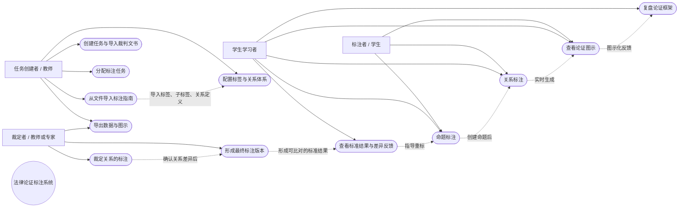

# 法律论证标注系统用例模型

## 1. 业务目标

系统不仅要把裁判文书标注成可训练的数据，还要把“命题—关系—论证图示”的完整链条呈现给学习者，使学生能够：

- 更快识别裁判理由中的事实判断、规范判断和裁判结论；
- 通过关系连线理解支持、反对、组合、匹配和同一关系；
- 通过标准答案对照和裁定反馈，定位自己的边界、标签和关系错误；
- 从一份文本的局部标注逐步形成对完整论证框架的结构化认识。

因此，教学反馈不是标注系统之外的附加信息，而是由标注指南导入、命题标注、关系裁定和论证图示共同产生的学习支持能力。

## 2. 系统用例图

### 2.1 用例关系说明

| 关系 | 说明 |
| --- | --- |
| 从文件导入标注指南 → 配置标签与关系体系 | 指南文件提供一级标签、二级标签、关系类型、定义和图示规则，减少教师手工录入规则的成本。 |
| 命题标注 → 关系标注 | 只有先建立命题，系统才能让用户建立命题之间的论证关系。 |
| 关系标注 → 查看论证图示 | 关系保存后实时更新图示，使学生同时看到文本证据和抽象结构。 |
| 裁定关系的标注 → 形成最终标注版本 | 裁定者确认关系方向、参与者和嵌套层级后，才形成最终数据。 |
| 形成最终标注版本 → 查看标准结果与差异反馈 | 最终版本既是数据集结果，也是学生进行自我比对的参考答案。 |
| 查看标准结果与差异反馈 → 命题标注 | 学生根据边界、标签和关系差异回到文本重新标注，形成闭环学习。 |

## 3. 用例描述一：从文件导入标注指南

| 项目 | 描述 |
| --- | --- |
| 用例名称 | 从文件导入标注指南 |
| 用例编号 | UC-01 |
| 主要参与者 | 任务创建者（教师、项目负责人或管理员） |
| 次要参与者 | 系统 |
| 业务目标 | 将外部指南文件转化为任务可使用、可追溯的标签、关系和图示规则，避免每次创建任务时重复配置。 |
| 学习价值 | 统一学生看到的标签定义、正反例和图示符号，降低记忆规则的成本，让学生把注意力集中在论证结构理解上。 |
| 前置条件 | 用户具有任务创建权限；文件格式为系统支持的 PDF、Word 或纯文本；任务尚未进入标注阶段。 |
| 触发器 | 用户在创建任务向导中选择“导入标注指南”。 |
| 后置条件 | 指南生成一个带版本号的规则集；任务记录该版本；导入结果可预览和修正；进入标注阶段后规则锁定。 |

### 基本流程

1. 用户选择本地指南文件。
2. 系统读取文件并提取指南名称、版本号、一级标签、二级标签、关系类型、定义和图示说明。
3. 系统展示导入预览：标签树、关系列表、形式化表达和缺失字段提示。
4. 用户检查导入结果，补充或修正解析不完整的名称、定义和示例。
5. 用户确认导入，系统生成指南版本快照。
6. 系统将指南版本绑定到当前任务，并在任务详情和导出记录中显示。

### 替代流程与异常

| 场景 | 系统行为 |
| --- | --- |
| 文件格式不支持 | 拒绝导入并说明支持的格式，不改变当前任务配置。 |
| 缺少版本号 | 允许用户手工填写版本号后继续，不允许留空。 |
| 解析出重复标签代码 | 标记冲突位置，要求用户修改后才能确认。 |
| 缺少关系图示规则 | 允许暂存草稿，但在任务开始标注前提示补齐；缺失关系不能在标注中启用。 |
| 任务已进入标注阶段 | 指南区域只读；如需修改，提示重新创建任务。 |

### 业务规则

- 同一任务只能绑定一个生效的指南版本。
- 导出 JSON、Excel 和图示时必须附带指南版本号。
- 标签代码稳定唯一；任务开始后不允许删除或重命名已使用的标签。
- 导入内容只作为规则配置，不自动替用户创建命题或关系。

## 4. 用例描述二：命题标注

| 项目 | 描述 |
| --- | --- |
| 用例名称 | 命题标注 |
| 用例编号 | UC-02 |
| 主要参与者 | 标注者（研究人员、教师或学生） |
| 次要参与者 | 系统、当前任务指南 |
| 业务目标 | 从裁判理由中识别可独立参与论证的文本片段，并为其赋予命题类型和必要的子类型。 |
| 学习价值 | 将连续文本拆成可观察的论证单元，使学生先回答“这句话在论证中是什么”，再理解它“与其他命题有什么关系”。 |
| 前置条件 | 用户已被分配文档；任务已进入标注阶段；任务已绑定指南版本；裁判理由范围已确定。 |
| 触发器 | 用户在原文区选择一句或一段文本并点击“创建命题”。 |
| 后置条件 | 命题保存字符索引、原文、序号和标签；命题出现在命题列表和图示节点中；草稿可继续编辑，提交后版本锁定。 |

### 基本流程

1. 系统在左栏展示裁判理由文本，并标示当前标注范围。
2. 用户拖选一句或一段文本。
3. 系统根据选区保存半开区间字符索引 `[start, end)`，按原文起始位置生成命题序号。
4. 系统将选中文本加入命题列表，并在原文中高亮。
5. 用户选择一级标签：IS、Non、GM、SM、GF 或 SF。
6. 若选择 GM 或 SM，系统展开对应二级标签；用户选择 GM-L/GM-I/GM-C/GM-U/GM-M/GM-O 或 SM-C。
7. 系统显示命题摘要、完整原文、字符索引和标签；用户可修改文本或标签。
8. 用户继续创建命题，系统按原文顺序实时重排编号。
9. 用户点击命题列表、原文高亮或图示节点时，三栏同步定位。
10. 用户提交版本，系统校验标签完整性和索引有效性，并锁定该版本。

### 替代流程与异常

| 场景 | 系统行为 |
| --- | --- |
| 选区为空 | 不创建命题，并提示“请选择裁判理由中的文本”。 |
| 选区跨越已标注命题 | 提示重叠范围，允许用户取消、缩小选区或删除后重新创建。 |
| 命题未选择一级标签 | 允许保存草稿，但提交时阻止并指出具体命题。 |
| GM/SM 未选择二级标签 | 允许保存草稿，但提交时阻止。 |
| 用户删除命题 | 采用删除并重新创建；系统同步移除引用该命题的关系并重新编号。 |
| 学生查看标准结果 | 当前版本切换为只读，并在原文、标签和图示处显示差异反馈。 |

### 业务规则

- 命题编号按原文顺序生成，不按创建先后固定编号。
- 命题原文在命题列表中完整展示，不省略。
- 标签含义以指南的显性定义为准，不根据背景知识自动推测。
- 系统不自动把多个命题合并为一个命题；合并通过删除后重新创建完成。
- 命题节点在图示中只显示序号，命题类型保存在标注数据中。

## 5. 用例描述三：裁定关系的标注

| 项目 | 描述 |
| --- | --- |
| 用例名称 | 裁定关系的标注 |
| 用例编号 | UC-03 |
| 主要参与者 | 裁定者（教师、项目负责人或领域专家） |
| 次要参与者 | 标注者、系统、任务指南 |
| 业务目标 | 对多个标注版本中的关系差异进行人工比对和裁定，确认最终的关系类型、方向、参与对象和嵌套层级。 |
| 学习价值 | 形成可供学生比对的标准论证图，并把“为什么是支持而不是组合、为什么是反对关系”等专家判断转化为可复盘的反馈。 |
| 前置条件 | 文档至少有一个已提交标注版本；命题版本可读取；关系类型已由任务指南锁定；任务处于待裁定阶段。 |
| 触发器 | 裁定者在任务详情中点击“进入裁定”，或系统检测到标注版本已提交。 |
| 后置条件 | 生成一个最终标注版本；每条关系有明确类型、方向和参与对象；裁定理由和来源版本被记录；任务可以进入结果输出阶段。 |

### 基本流程

1. 系统展示原文、命题列表和当前文档的全部已提交版本。
2. 裁定者按关系条目人工比对各版本，不要求系统自动定位差异。
3. 系统并列显示关系类型、关系方向、参与命题、嵌套单元和图示效果。
4. 裁定者选择某一版本的关系，或在最终版本中直接编辑关系。
5. 裁定者确认关系类型：S 支持、A 反对、J 组合、M 匹配、I 同一。
6. 裁定者检查关系约束：M 连接个别判断与一般判断；J/I 至少包含两个参与对象；嵌套关系保持层级。
7. 系统将最终关系同步渲染为论证图：命题为矩形节点，关系按指南使用实心圆、空心圆、“+”圆或同一关系表示。
8. 裁定者填写必要的裁定说明并提交最终版本。
9. 系统锁定最终版本，记录裁定者、时间、采用来源和修改内容。
10. 学生或标注者查看结果时，可将自己的关系与最终关系并列对照，回到命题标注页面复盘。

### 替代流程与异常

| 场景 | 系统行为 |
| --- | --- |
| 只有一个标注版本 | 仍展示裁定页面，裁定者需要确认或修改后才能形成最终版本。 |
| 两个版本关系类型不同 | 标记为类型差异，裁定者必须选择或编辑一个最终类型。 |
| 关系方向不同 | 在图示和关系表中同时标记方向差异，禁止静默合并。 |
| J/I 只有一个参与对象 | 阻止提交并提示至少需要两个参与对象。 |
| M 两端类型不符合约束 | 阻止提交并提示必须连接个别判断与一般判断。 |
| 反对关系攻击的是支持关系 | 将支持关系作为嵌套单元保留，表达为 `A(p, S(pi,pj))`，不得降级成直接反对命题。 |
| 裁定中发现指南规则不足 | 允许在裁定说明中记录疑难问题；当前任务标签体系不直接修改。 |

### 业务规则

- 裁定者可以采用某个版本，也可以直接重标最终关系。
- 关系差异的判定维度至少包括类型、方向、参与对象和嵌套层级。
- 关系图示必须由关系数据生成，不能只修改图上的线而不更新关系记录。
- 关系提交前必须通过指南约束校验。
- 最终关系版本只读；需要重标时重新创建任务或复制为新的练习版本。

## 6. 学习闭环

三个用例共同形成以下闭环：

`导入统一规则 → 学生/标注者识别命题 → 建立关系 → 教师/专家裁定 → 图示化呈现 → 差异反馈 → 学生重标与复盘`

其中，速度来自可复用的指南和自动编号、自动校验、双向联动；质量来自独立标注、专家裁定、关系约束和标准结果比对。系统的教学价值不是替学生完成判断，而是让学生更快看到“文本证据如何组成论证框架”，并能定位自己在哪一层发生了偏差。
